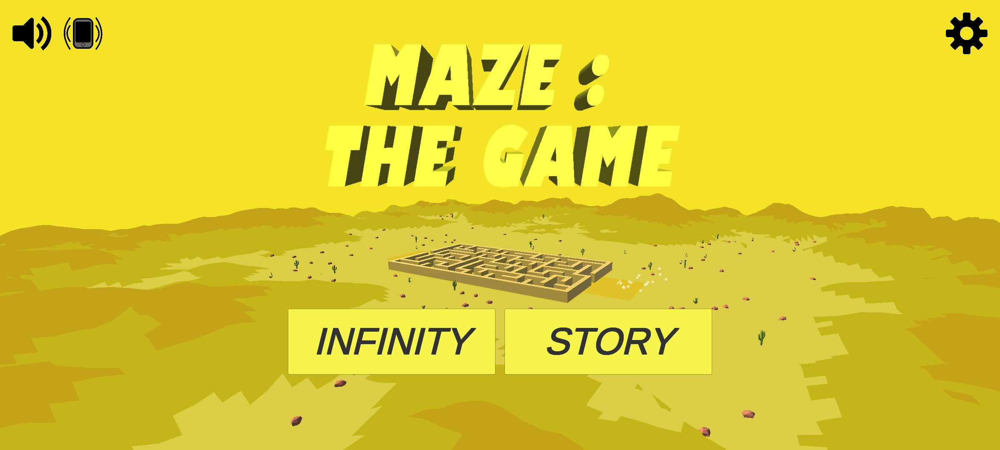
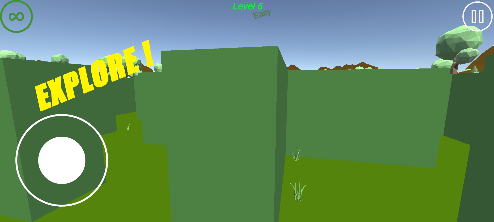
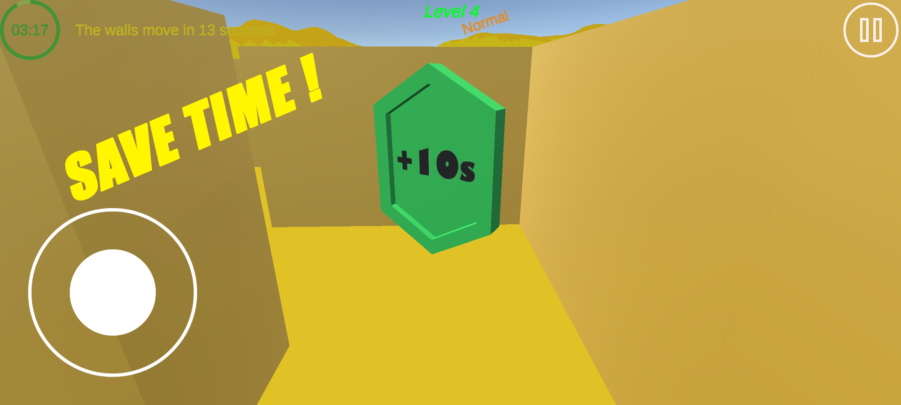
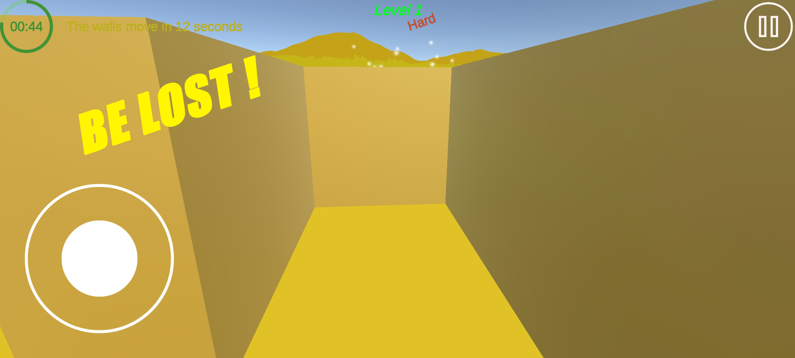
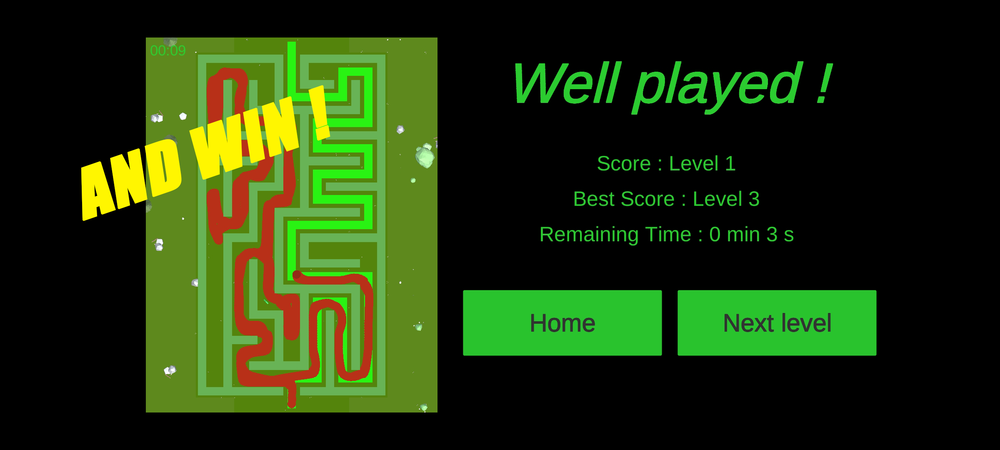
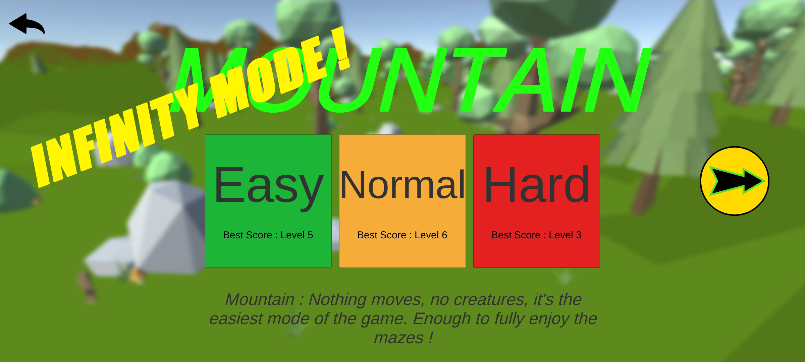
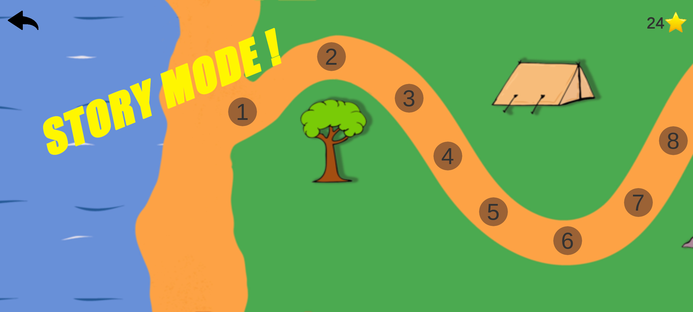

# Maze : The Game 

> *Note: This project was originally developed in 2021. It is published here for archiving and portfolio purposes, and is no longer actively maintained.*

**[Play now on Google Play](https://play.google.com/store/apps/details?id=com.BravePixelsGames.MazeTheGame)**

Maze : The Game is a maze game with an infinity of levels! 
Choose between the mountain environment (classic mazes) or the desert environment (where the walls move!). Try to complete the biggest mazes in Infinity mode, or tackle the 15 levels of increasing difficulty in Story mode. Brave Pixels Games challenges you to complete all levels without getting lost!

## 🎮 Features
* **Infinity Mode**: Complete as many mazes as possible within the allotted time.
* **Story Mode**: 15 levels of increasing difficulty with star-based progression.
* **Dynamic Environments**: Classic mountain mazes and challenging desert mazes with moving walls.
* **Difficulty Levels**: Easy, Normal, and Hard (affects time limits and time pieces).

## 🛠️ Technologies
* **Game Engine**: Unity 2020.3.26f1
* **Language**: C#
* **Platform**: Android

## ⚙️ How to open the project
To run this project locally, you will need Unity Hub.

1. Clone this repository: `git clone https://github.com/AlphaRaph/maze-the-game.git`
2. Open **Unity Hub**.
3. Click on **Open** -> **Add project from disk** and select the cloned folder.
4. Ensure you have installed Unity **2020.3.26f1** with the Android Build Support module.
5. Open the `Home` scene in the `Assets` folder.

## 📸 Screenshots

  
  
  
  
  
  

## 📄 License
All rights reserved
